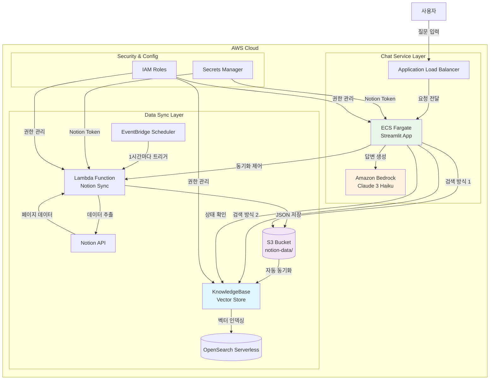

# 🤖 Notion RAG Chatbot

Notion 워크스페이스의 내용을 기반으로 질문에 답변하는 AI 챗봇입니다. AWS CDK로 구현되었으며, Claude 3 Haiku와 RAG(Retrieval-Augmented Generation) 방식을 사용합니다.

## 🌟 주요 기능

- 🔍 **이중 검색 방식**: KnowledgeBase 벡터 검색 + S3 키워드 검색 비교
- 🤖 **AI 기반 답변**: Claude 3 Haiku를 활용한 빠르고 경제적인 답변 생성
- 📚 **소스 추적**: 답변의 근거가 된 Notion 문서 링크 제공
- 🔄 **통합 동기화**: S3 + KnowledgeBase 동시 동기화 및 상태 모니터링
- 💬 **대화 컨텍스트**: 이전 대화 내용을 기억하여 연속적인 대화 지원
- 📊 **실시간 상태**: 동기화 진행 상황 및 대화 기록 수 표시

## 🏗️ 시스템 아키텍처



## 🔄 동작 방식

### 1. 데이터 동기화 프로세스
1. **자동 동기화**: EventBridge가 1시간마다 Lambda 함수 트리거
2. **Notion 데이터 추출**: Lambda가 Notion API를 통해 페이지 검색 및 내용 추출
3. **S3 저장**: 페이지 내용을 JSON 형태로 S3에 저장
4. **KnowledgeBase 동기화**: S3 데이터를 벡터화하여 OpenSearch Serverless에 인덱싱
5. **수동 동기화**: Streamlit 앱에서 통합 동기화 버튼으로 즉시 실행 가능

### 2. 질문-답변 프로세스
1. **사용자 질문**: 자연어로 질문 입력
2. **이중 검색 방식**:
   - **KnowledgeBase 검색**: 벡터 기반 의미 검색으로 관련 문서 추출
   - **S3 키워드 검색**: 직접 키워드 매칭으로 관련 문서 추출
3. **컨텍스트 구성**: 이전 대화 내용 + 검색된 문서들을 컨텍스트로 구성
4. **RAG 답변 생성**: Claude 3 Haiku가 컨텍스트 기반으로 정확한 답변 생성
5. **참고 문서 표시**: 답변과 함께 실제 Notion 페이지 제목, 내용, 링크 제공

### 3. 대화 컨텍스트 관리
- **연속 대화**: 최근 3개 대화 쌍을 기억하여 맥락 유지
- **대화 초기화**: 언제든 대화 기록 삭제 가능
- **실시간 상태**: 현재 대화 기록 수 표시

## 🚀 배포 방법

### 사전 요구사항
- AWS CLI 설치 및 설정
- AWS CDK v2 설치
- Node.js 18 이상
- Python 3.11 이상
- Notion Integration 토큰

### 빠른 시작
```bash
# 1. 저장소 클론
git clone https://github.com/yourusername/notion-rag-chatbot.git
cd notion-rag-chatbot

# 2. 환경 변수 설정
export NOTION_TOKEN="your_notion_token"

# 3. 원클릭 배포
./deploy.sh
```

### 수동 배포
```bash
# 1. CDK 의존성 설치
cd cdk
pip install -r requirements.txt

# 2. CDK 배포 (순서대로)
cdk bootstrap
cdk deploy NotionChatbotVpcStack
cdk deploy NotionChatbotSecretsStack
cdk deploy NotionChatbotBedrockStack
cdk deploy NotionChatbotCompleteKBStack
cdk deploy NotionChatbotEcsStack

# 3. Notion 토큰 저장
aws secretsmanager put-secret-value \
  --secret-id notion-chatbot/notion-token \
  --secret-string "{\"token\":\"your_notion_token\"}"
```

## 📁 프로젝트 구조
```
notion-rag-chatbot/
├── README.md
├── deploy.sh                     # 원클릭 배포 스크립트
├── cdk/                         # AWS CDK 인프라 코드
│   ├── app.py
│   ├── requirements.txt
│   └── stacks/
│       ├── vpc_stack.py         # VPC, 보안 그룹
│       ├── secrets_stack.py     # Secrets Manager
│       ├── bedrock_stack.py     # S3, Lambda, EventBridge
│       ├── complete_knowledgebase_stack.py  # KnowledgeBase, OpenSearch
│       └── ecs_stack.py         # ECS Fargate, ALB
├── streamlit/                   # Streamlit 애플리케이션
│   ├── app_knowledgebase.py    # 메인 애플리케이션 (KnowledgeBase 통합)
│   ├── requirements.txt
│   ├── Dockerfile
│   └── utils/
│       ├── s3_search.py        # S3 키워드 검색
│       └── bedrock_utils.py    # Bedrock 유틸리티
└── docs/                       # 문서
    ├── deployment.md          # 상세 배포 가이드
    └── user-guide.md         # 사용자 가이드
```

## ⚙️ 기술 스택

### Frontend
- **Streamlit**: 대화형 웹 인터페이스
- **Streamlit Components**: 채팅 UI, 사이드바, 상태 표시

### Backend
- **AWS ECS Fargate**: 컨테이너 오케스트레이션
- **AWS Lambda**: Notion 데이터 동기화
- **Amazon S3**: 문서 저장소
- **Amazon EventBridge**: 자동 동기화 스케줄링

### AI/ML & Vector Search
- **Amazon Bedrock**: Claude 3 Haiku 모델
- **Amazon Bedrock KnowledgeBase**: RAG 벡터 검색
- **Amazon OpenSearch Serverless**: 벡터 인덱스 저장
- **Amazon Titan Embeddings**: 텍스트 벡터화

### Infrastructure
- **AWS CDK**: 인프라스트럭처 as 코드
- **Docker**: 컨테이너화
- **AWS Secrets Manager**: 보안 토큰 관리
- **AWS IAM**: 세밀한 권한 관리

## 💰 예상 비용 (월간)

| 서비스 | 예상 비용 | 비고 |
|--------|-----------|------|
| ECS Fargate | $25 | 1 vCPU, 2GB RAM |
| Claude 3 Haiku | $5-20 | 사용량 기준 |
| OpenSearch Serverless | $15-30 | 벡터 인덱스 크기 기준 |
| S3 + Lambda | $5 | 기본 사용량 |
| KnowledgeBase | $10 | 쿼리 수 기준 |
| 기타 AWS 서비스 | $10 | CloudWatch, ALB 등 |
| **총 예상 비용** | $70-100 | 사용량에 따라 변동 |

## 🔒 보안

### IAM 권한
- **ECS Task Role**: S3 읽기, Lambda 호출, Bedrock 호출, KnowledgeBase 관리
- **Lambda Role**: Notion API 호출, S3 쓰기
- **KnowledgeBase Service Role**: S3 읽기, OpenSearch 접근
- 최소 권한 원칙 준수

### 데이터 보안
- Secrets Manager로 토큰 관리
- VPC 내부 통신
- HTTPS 통신
- OpenSearch Serverless 암호화

## 📈 성능

### 응답 시간
- **KnowledgeBase 검색**: 3-7초 (벡터 검색 + RAG)
- **S3 키워드 검색**: 2-5초 (직접 검색)
- **대화 컨텍스트**: 추가 1-2초

### 확장성
- Auto Scaling: CPU 사용률 70% 기준
- 동시 사용자: ~100명
- 벡터 인덱스: 수천 개 문서 지원

## 🛠️ 커스터마이징

### 환경 변수
```bash
# .env 파일
NOTION_TOKEN=your_token
AWS_REGION=ap-northeast-2
KNOWLEDGE_BASE_ID=UXF2GSP5IT
MAX_TOKENS=4000
TEMPERATURE=0.1
```

### 설정 파일
```python
# config.py
SEARCH_LIMIT = 5
CACHE_TTL = 300
AUTO_SYNC_INTERVAL = "1 hour"
CONTEXT_WINDOW = 3  # 대화 컨텍스트 유지 개수
```

## 🤝 기여하기

1. Fork the Project
2. Create your Feature Branch (\`git checkout -b feature/AmazingFeature\`)
3. Commit your Changes (\`git commit -m 'Add some AmazingFeature'\`)
│   ├── app.py
│   ├── requirements.txt
│   └── stacks/
│       ├── vpc_stack.py         # VPC, 보안 그룹
│       ├── secrets_stack.py     # Secrets Manager
│       ├── bedrock_stack.py     # S3, Lambda, EventBridge
│       └── ecs_stack.py         # ECS Fargate, ALB
├── streamlit/                   # Streamlit 애플리케이션
│   ├── app.py                  # 메인 애플리케이션
│   ├── requirements.txt
│   ├── Dockerfile
│   ├── components/
│   │   ├── chat_interface.py   # 채팅 UI
│   │   └── sidebar.py         # 사이드바 설정
│   └── utils/
│       ├── config.py          # 설정 관리
│       ├── mcp_client.py      # Notion MCP 클라이언트
│       └── bedrock_client.py  # Bedrock 클라이언트
└── docs/                       # 문서
    ├── deployment.md          # 상세 배포 가이드
    └── user-guide.md         # 사용자 가이드
```

## ⚙️ 기술 스택

### Frontend
- Streamlit: 대화형 웹 인터페이스
- Streamlit Components: 채팅 UI, 사이드바

### Backend
- AWS ECS Fargate: 컨테이너 오케스트레이션
- AWS Lambda: Notion 데이터 동기화
- Amazon S3: 문서 저장소
- Amazon EventBridge: 자동 동기화 스케줄링

### AI/ML
- Amazon Bedrock: Claude 3.5 Sonnet
- RAG (Retrieval-Augmented Generation)

### Infrastructure
- AWS CDK: 인프라스트럭처 as 코드
- Docker: 컨테이너화
- AWS Secrets Manager: 보안 토큰 관리

## 💰 예상 비용 (월간)

| 서비스 | 예상 비용 | 비고 |
|--------|-----------|------|
| ECS Fargate | $25 | 1 vCPU, 2GB RAM |
| Claude 3 Haiku | $5-20 | 사용량 기준 |
| S3 + Lambda | $5 | 기본 사용량 |
| 기타 AWS 서비스 | $10 | CloudWatch, ALB 등 |
| **총 예상 비용** | $45-60 | 사용량에 따라 변동 |

## 🔒 보안

### IAM 권한
- ECS Task Role: S3 읽기, Lambda 호출, Bedrock 호출
- Lambda Role: Notion API 호출, S3 쓰기
- 최소 권한 원칙 준수

### 데이터 보안
- Secrets Manager로 토큰 관리
- VPC 내부 통신
- HTTPS 통신

## 📈 성능

### 응답 시간
- 일반적인 질문: 2-5초
- 복잡한 질문: 5-10초

### 확장성
- Auto Scaling: CPU 사용률 70% 기준
- 동시 사용자: ~100명

## 🛠️ 커스터마이징

### 환경 변수
```bash
# .env 파일
NOTION_TOKEN=your_token
AWS_REGION=ap-northeast-2
MAX_TOKENS=4000
TEMPERATURE=0.1
```

### 설정 파일
```python
# config.py
SEARCH_LIMIT = 5
CACHE_TTL = 300
AUTO_SYNC_INTERVAL = "1 hour"
```

## 🤝 기여하기

1. Fork the Project
2. Create your Feature Branch (\`git checkout -b feature/AmazingFeature\`)
3. Commit your Changes (\`git commit -m 'Add some AmazingFeature'\`)
4. Push to the Branch (\`git push origin feature/AmazingFeature\`)
5. Open a Pull Request

## 📝 라이선스

MIT License - [LICENSE](LICENSE) 파일을 참조하세요.

## 👥 문의

- GitHub Issues
- Discussions
- Pull Requests

## 🙏 감사의 글

- AWS CDK 팀
- Streamlit 팀
- Anthropic (Claude)
- Notion API 팀

## 📚 참고 자료

- [AWS CDK Documentation](https://docs.aws.amazon.com/cdk/)
- [Streamlit Documentation](https://docs.streamlit.io/)
- [Notion API Documentation](https://developers.notion.com/)
- [Claude Documentation](https://docs.anthropic.com/claude/)

---

**Note**: 이 프로젝트는 프로덕션 환경에서 사용 가능하도록 설계되었으나, 각 조직의 보안 요구사항과 규정을 준수하도록 추가 설정이 필요할 수 있습니다.
