# 🤖 Notion RAG Chatbot

Notion 워크스페이스의 내용을 기반으로 질문에 답변하는 AI 챗봇입니다. AWS CDK로 구현되었으며, Claude 3.5 Sonnet과 RAG(Retrieval-Augmented Generation) 방식을 사용합니다.

## 🌟 주요 기능

- 🔍 **실시간 Notion 검색**: S3 기반의 효율적인 문서 검색
- 🤖 **AI 기반 답변**: Claude 3.5 Sonnet을 활용한 정확한 답변 생성
- 📚 **소스 추적**: 답변의 근거가 된 Notion 문서 링크 제공
- 🔄 **자동 동기화**: 1시간마다 Notion 데이터 자동 업데이트
- 💬 **대화 히스토리**: 이전 대화 내용 유지 및 관리
- 📊 **사용 통계**: 대화 및 문서 참조 통계 제공

## 🏗️ 시스템 아키텍처

```mermaid
graph TB
    subgraph AWS Cloud
        subgraph Data Sync
            A[EventBridge] -->|1시간마다 트리거| B[Lambda Function]
            B -->|데이터 추출| C[Notion API]
            B -->|저장| D[(S3 Bucket)]
        end
        
        subgraph Chat Service
            E[Application Load Balancer] -->|요청 전달| F[ECS Fargate]
            F -->|컨테이너 실행| G[Streamlit App]
            G -->|문서 검색| D
            G -->|답변 생성| H[Claude 3.5 Sonnet]
        end
        
        subgraph Security
            I[Secrets Manager] -->|토큰 제공| B
            I -->|토큰 제공| G
        end
    end
    
    J[사용자] -->|질문| E
    C -->|페이지 데이터| B
```

## 🔄 동작 방식

### 1. 데이터 동기화 프로세스
1. EventBridge가 1시간마다 Lambda 함수 트리거
2. Lambda 함수가 Notion API를 통해 페이지 검색
3. 페이지 내용을 추출하여 S3에 JSON 형태로 저장
4. 수동 동기화도 사이드바에서 가능

### 2. 질문-답변 프로세스
1. 사용자가 자연어로 질문 입력
2. Streamlit 앱이 S3에서 키워드 기반으로 관련 문서 검색
3. 검색된 문서들을 컨텍스트로 Claude 3.5 Sonnet에 전달
4. RAG 방식으로 정확한 답변 생성
5. 답변과 함께 참고 문서 링크 제공

## 🚀 배포 방법

### 사전 요구사항
- AWS CLI 설치 및 설정
- AWS CDK v2 설치
- Node.js 18 이상
- Python 3.11 이상
- Notion Integration 토큰

### 빠른 시작
\`\`\`bash
# 1. 저장소 클론
git clone https://github.com/yourusername/notion-rag-chatbot.git
cd notion-rag-chatbot

# 2. 환경 변수 설정
export NOTION_TOKEN="your_notion_token"

# 3. 원클릭 배포
./deploy.sh
\`\`\`

### 수동 배포
\`\`\`bash
# 1. CDK 의존성 설치
cd cdk
pip install -r requirements.txt

# 2. CDK 배포
cdk bootstrap
cdk deploy --all

# 3. Notion 토큰 저장
aws secretsmanager put-secret-value \
  --secret-id notion-chatbot/notion-token \
  --secret-string "{\"token\":\"your_notion_token\"}"
\`\`\`

## 📁 프로젝트 구조
\`\`\`
notion-rag-chatbot/
├── README.md
├── deploy.sh                     # 원클릭 배포 스크립트
├── cdk/                         # AWS CDK 인프라 코드
│   ├── app.py
│   ├── requirements.txt
│   └── stacks/
│       ├── vpc_stack.py         # VPC, 보안 그룹
│       ├── secrets_stack.py     # Secrets Manager
│       ├── bedrock_stack.py     # S3, Lambda, EventBridge
│       └── ecs_stack.py         # ECS Fargate, ALB
├── streamlit/                   # Streamlit 애플리케이션
│   ├── app.py                  # 메인 애플리케이션
│   ├── requirements.txt
│   ├── Dockerfile
│   ├── components/
│   │   ├── chat_interface.py   # 채팅 UI
│   │   └── sidebar.py         # 사이드바 설정
│   └── utils/
│       ├── config.py          # 설정 관리
│       ├── mcp_client.py      # Notion MCP 클라이언트
│       └── bedrock_client.py  # Bedrock 클라이언트
└── docs/                       # 문서
    ├── deployment.md          # 상세 배포 가이드
    └── user-guide.md         # 사용자 가이드
\`\`\`

## ⚙️ 기술 스택

### Frontend
- Streamlit: 대화형 웹 인터페이스
- Streamlit Components: 채팅 UI, 사이드바

### Backend
- AWS ECS Fargate: 컨테이너 오케스트레이션
- AWS Lambda: Notion 데이터 동기화
- Amazon S3: 문서 저장소
- Amazon EventBridge: 자동 동기화 스케줄링

### AI/ML
- Amazon Bedrock: Claude 3.5 Sonnet
- RAG (Retrieval-Augmented Generation)

### Infrastructure
- AWS CDK: 인프라스트럭처 as 코드
- Docker: 컨테이너화
- AWS Secrets Manager: 보안 토큰 관리

## 💰 예상 비용 (월간)

| 서비스 | 예상 비용 | 비고 |
|--------|-----------|------|
| ECS Fargate | $25 | 1 vCPU, 2GB RAM |
| Claude 3.5 Sonnet | $30-100 | 사용량 기준 |
| S3 + Lambda | $5 | 기본 사용량 |
| 기타 AWS 서비스 | $10 | CloudWatch, ALB 등 |
| **총 예상 비용** | $70-140 | 사용량에 따라 변동 |

## 🔒 보안

### IAM 권한
- ECS Task Role: S3 읽기, Lambda 호출, Bedrock 호출
- Lambda Role: Notion API 호출, S3 쓰기
- 최소 권한 원칙 준수

### 데이터 보안
- Secrets Manager로 토큰 관리
- VPC 내부 통신
- HTTPS 통신

## 📈 성능

### 응답 시간
- 일반적인 질문: 2-5초
- 복잡한 질문: 5-10초

### 확장성
- Auto Scaling: CPU 사용률 70% 기준
- 동시 사용자: ~100명

## 🛠️ 커스터마이징

### 환경 변수
\`\`\`bash
# .env 파일
NOTION_TOKEN=your_token
AWS_REGION=ap-northeast-2
MAX_TOKENS=4000
TEMPERATURE=0.1
\`\`\`

### 설정 파일
\`\`\`python
# config.py
SEARCH_LIMIT = 5
CACHE_TTL = 300
AUTO_SYNC_INTERVAL = "1 hour"
\`\`\`

## 🤝 기여하기

1. Fork the Project
2. Create your Feature Branch (\`git checkout -b feature/AmazingFeature\`)
3. Commit your Changes (\`git commit -m 'Add some AmazingFeature'\`)
4. Push to the Branch (\`git push origin feature/AmazingFeature\`)
5. Open a Pull Request

## 📝 라이선스

MIT License - [LICENSE](LICENSE) 파일을 참조하세요.

## 👥 문의

- GitHub Issues
- Discussions
- Pull Requests

## 🙏 감사의 글

- AWS CDK 팀
- Streamlit 팀
- Anthropic (Claude)
- Notion API 팀

## 📚 참고 자료

- [AWS CDK Documentation](https://docs.aws.amazon.com/cdk/)
- [Streamlit Documentation](https://docs.streamlit.io/)
- [Notion API Documentation](https://developers.notion.com/)
- [Claude Documentation](https://docs.anthropic.com/claude/)

---

**Note**: 이 프로젝트는 프로덕션 환경에서 사용 가능하도록 설계되었으나, 각 조직의 보안 요구사항과 규정을 준수하도록 추가 설정이 필요할 수 있습니다.
